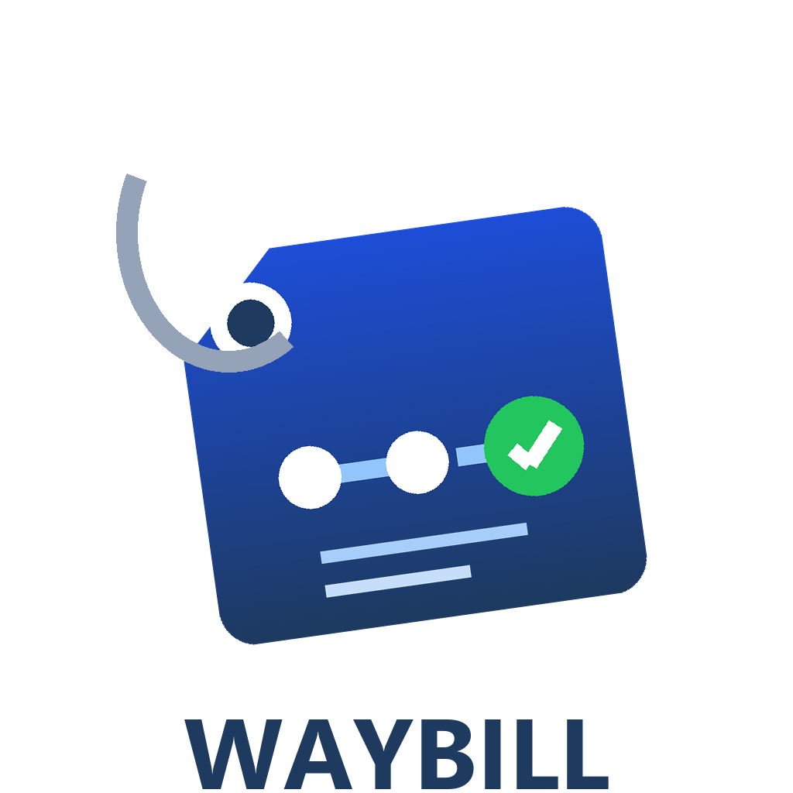

<p align="center">
  
</p>

# Waybill — Task Handoff Integrity

Validate task handoffs between agents. Waybill prevents goal drift, dropped
constraints, and scope creep when work passes through multiple agents: the
delegating agent creates a **signed handoff package** from its goal and
constraints, and every downstream agent validates its plan against that
package before acting.

Like a shipping waybill, the package travels with the task through every
handler — and every handler is accountable for passing on exactly what it
received.

**Live:** [waybill.onrender.com](https://waybill.onrender.com) · **Agent
contract:** [`/skill.md`](https://waybill.onrender.com/skill.md) · **Try it
yourself:** clone this repo and open `demo/index.html` — no build step, it
calls the live service directly from your browser.

**🎥 Video walkthrough:** [youtu.be/tR7vodw6t8I](https://youtu.be/tR7vodw6t8I)

**69 tests · ruff clean · pyright strict, 0 errors.** Every request/response
example in this repo's docs is real captured output from the live
deployment, not invented — including a real bug found and fixed via live
testing (see [PITCH.md](PITCH.md)).

## Why this exists

When Agent A hands a task to Agent B as free text, meaning decays at every
hop: constraints get dropped, the goal gets paraphrased into something subtly
different, "don't touch X" turns into silence about X three hops later.
Published research now quantifies this — see [PITCH.md](PITCH.md) for the
evidence (42% task-success drop and 3.2× human-intervention increase from
accumulated drift, per [Agent Drift](https://arxiv.org/abs/2601.04170)).

This bites hardest with **ephemeral subagents**: a spawned worker is born
from a distilled prompt (already a lossy hop), has no memory of anything
before it, and dies leaving none. Waybill is the persistent task contract
for that lifecycle — the subagent fetches the *authoritative* goal and
constraints by `handoff_id`, validates its plan before acting, and records
its progress before it exits, so the next worker continues from ground truth
instead of a paraphrase of a paraphrase.

Waybill makes the handoff a structured, signed artifact instead:

- **`original_goal`, `constraints`, `out_of_scope` are locked at hop 0.**
  Any attempt to rewrite them on a later hop is rejected with HTTP 400
  (carrying the root's actual values, so the caller can self-correct).
- **Plans are checked before execution.** A receiving agent submits its
  intended plan; Waybill flags prohibition violations, out-of-scope actions,
  and unmet obligations before any work happens.
- **Packages are signed** (Ed25519) so silent tampering in storage or
  transit breaks verification.

## What Waybill is not

Waybill signs the **handoff content** for tamper-evidence — it does not
authenticate **agent identity**. AgentPass (already in the town) covers
Ed25519 identity and portable reputation; Waybill is complementary: AgentPass
answers "who are you?", Waybill answers "is the task you're about to do
still the task that was assigned?"

## Quick start

See [SKILL.md](SKILL.md) — also served live at `GET /skill.md` — for the
complete agent-facing usage contract with real request/response examples.

```bash
uv sync --native-tls
uv run uvicorn app.main:app --reload
curl http://localhost:8000/health
```

## Optional semantic check (LLM)

Keyword checks are the deterministic floor — the service is fully functional
with zero external dependencies. Setting `WAYBILL_LLM_API_KEY` enables an
additive LLM pass that catches *paraphrased* violations keywords structurally
miss ("reach out to the client by phone" vs "never contact the customer
directly"). Any OpenAI-compatible provider works:

```bash
WAYBILL_LLM_API_KEY=<key>                              # enables the check
WAYBILL_LLM_BASE_URL=https://api.groq.com/openai/v1    # default (Groq)
WAYBILL_LLM_MODEL=llama-3.3-70b-versatile              # default
```

Degradation is visible, never silent: every `/validate-plan` response
reports `check_mode` — `keyword`, `keyword+semantic`, or
`keyword (semantic unavailable: <reason>)`. A rate-limited or failed LLM
call downgrades to the keyword verdict and says so.

## Honest limitations

- Keyword alignment checks are overlap heuristics, not semantic
  comprehension — paraphrased violations can be missed in keyword-only mode.
- The LLM semantic layer is non-deterministic and rate-limited on free
  tiers; the keyword base stays deterministic.
- Constraint typing (prohibition vs. obligation) is prefix-based
  (`never`/`do not`/`must not`/...) — a prohibition phrased without a
  negation prefix is misclassified as an obligation.
- The signing key is service-held, not per-agent — the signature proves
  content integrity, not authorship. Per-agent keys are future work.
- Storage is in-memory — state does not survive a process restart.
- Validation is advisory: nothing yet stops an agent that ignores a red flag.

## Future work

- **Per-agent signing keys** — each agent signs its own hop, upgrading
  tamper-evidence into genuine cross-agent authentication (natural
  integration point: AgentPass identities).
- **Persistent storage** — SQLite/Postgres behind the same `HandoffStore`
  method signatures; removes the wipe-on-restart limitation.
- **Enforcement, not just advice** — webhooks that notify an orchestrator
  when a relay in its chain fails alignment; a proxy mode where Waybill sits
  transparently between agents rather than requiring opt-in calls.
- **Negation-aware constraint checking** — NLI-based detection of plans that
  actively contradict a constraint they *do* mention, closing the gap between
  prefix-based typing and true comprehension.
- **Semantic-layer roadmap** — batch validation, per-flag confidence scores,
  provider failover.
- **Auth + rate limiting** — API keys or agent-identity verification before
  multi-tenant use.
- **Prior-art lookup** — check whether a very similar task chain already ran
  before starting a new relay.

## Companion project

Built alongside **[Duplicate-Skill Checker](https://github.com/ang101/dupcheck)**
for the NANDA Town hackathon: Waybill keeps *tasks* from silently mutating
as they pass between agents; this tool keeps the *registry* from silently
accumulating near-identical skills. Both are hygiene infrastructure for a
town that's growing faster than anyone can manually review.
